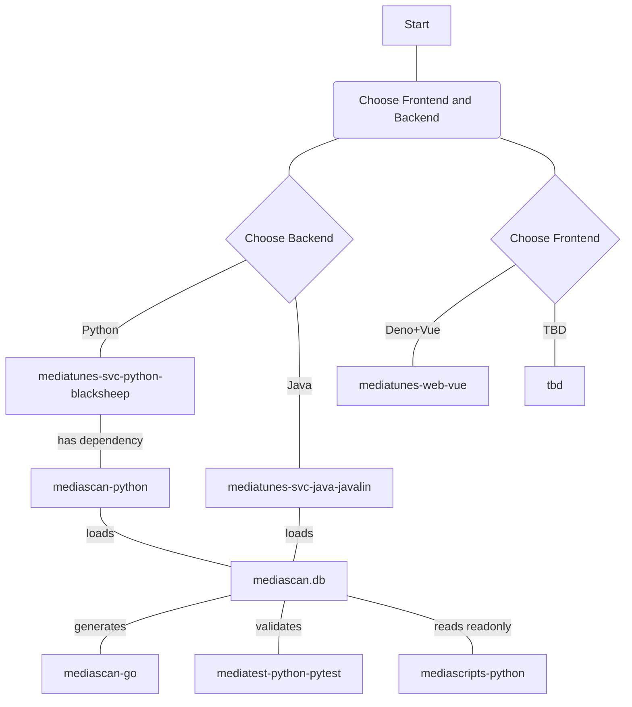

# moongas-mediascripts-python  

> 🚧 **Status: Work in Progress (WIP)**  
> This project is currently under active development. Features, APIs, and documentation are subject to change.

---

## Overview

**Python scripts for working with Moongas media collections.**

### A component of the `moongas` ecosystem of media library tools

- [moongas-collection-demo](https://github.com/moongas-org/moongas-collection-demo) [](https://github.com/moongas-org/moongas-collection-demo/actions/workflows/ci.yml) - Example Moongas media collection (metadata only)
- [moongas-mediatunes-web-vue](https://github.com/moongas-org/moongas-mediatunes-web-vue) [](https://github.com/moongas-org/moongas-mediatunes-web-vue/actions/workflows/ci.yml) - A Deno-tooled TypeScript/Vue SPA for Moongas hybrid media collections, pairing with the separate moongas-mediatunes-svc-python-blacksheep backend to seemlessly blend offline and streaming playback
- [moongas-mediatunes-svc-python-blacksheep](https://github.com/moongas-org/moongas-mediatunes-svc-python-blacksheep) [](https://github.com/moongas-org/moongas-mediatunes-svc-python-blacksheep/actions/workflows/ci.yml) - Python+BlackSheep implementation of API service for Moongas hybrid media collections—backend for Moongas mediatunes web application (moongas-mediatunes-web-vue)
- [moongas-mediatunes-svc-java-javalin](https://github.com/moongas-org/moongas-mediatunes-svc-java-javalin) [](https://github.com/moongas-org/moongas-mediatunes-svc-java-javalin/actions/workflows/ci.yml) - Java+Javalin implementation of API service for Moongas hybrid media collections—backend for Moongas mediatunes web application (moongas-mediatunes-web-vue)
- [moongas-mediascan-go](https://github.com/moongas-org/moongas-mediascan-go) [](https://github.com/moongas-org/moongas-mediascan-go/actions/workflows/ci.yml) - Golang module to scan media collections and Moongas Yaml metatadata, outputs Moongas database
- [moongas-mediascan-python](https://github.com/moongas-org/moongas-mediascan-python) [](https://github.com/moongas-org/moongas-mediascan-python/actions/workflows/ci.yml) - Python library with data classes for loading Moongas mediascan databases and Yaml metadata files
- [moongas-mediascripts-python](https://github.com/moongas-org/moongas-mediascripts-python) [](https://github.com/moongas-org/moongas-mediascripts-python/actions/workflows/ci.yml) - Python scripts for working with Moongas media collections.
- [moongas-mediatest-python-pytest](https://github.com/moongas-org/moongas-mediatest-python-pytest) [](https://github.com/moongas-org/moongas-mediatest-python-pytest/actions/workflows/ci.yml) - Python tool for enforcing media collection rules (implemented with `pytest`)

## Live Demos
- [Live Demo (hosted on moongas.org)](https://moongas.org/mediaserver)
- [Live Demo (hosted on moongas.org)](https://moongas.org/mediaserver)



# Quick Start

```bash
pip install "git+https://github.com/moongas-org/moongas-mediascripts-python.git[stats]"
```

### (Developer) Clone GitHub repo and install (editable)

```bash
git clone git@github.com:moongas-org/moongas-mediascan-python.git
cd moongas-mediascan-python
python -m pip install -e ".[dev,llm,stats]"
```

### Optional dependency groups

- `[dev]` - development dependencies (includes `pytest` and `ruff`)
- `[stats]` - statistics script dependencies (includes `matplotlib` and `numpy`)

# Usage

The `mediascripts` package installs a console script named `mediascripts` so it can be executed either with `python -m mediascripts` or simply with `mediascripts`.

```bash
$ mediascripts --h
usage: mediascripts [-h] [--list] [--create-script-symlinks]

Utility for media* console script entry points.

options:
  -h, --help            show this help message and exit
  --list                list all media* console script entry points, grouped by scripts subdirectory
  --create-script-symlinks
                        create hyphenated symlinks in the current directory to every console entry script and every shell script in
                        scripts/shell
```

The `--list` option may be used to list all console scripts and shell scripts installed by any `media*` packages.
```bash
$ mediascripts --list
artist:
  artist-countries-to-mapgraph-json
  artist-csv-to-artist-yaml
  artist-yaml-auto-populate
  artist-yaml-reformat-with-files-yaml
  artist-yaml-test-with-files-yaml
  list-missing-region-names
convert:
  convert-covers
  convert-videos
  make-covers-video
copy:
  copy-medialib
dev:
  generate-dataclasses
lyrics:
  lyrics-text-auto-populate
media_files_yaml:
  list-artists-from-files-yaml
  play-rand-file-from-files-yaml
rename:
  rename-album-files
stats:
  genre-clusters
  mediastats
```

## `show-env` - Show Moongas Environment Variables
```bash
user@host:~/Git/moongas-org/moongas/moongas-collection-local$ ./show-env 
------------------------------------------------------------------------------
                             Moongas Environment                              
------------------------------------------------------------------------------
  MOONGAS_COLLECTION_ROOTDIR:
    "/home/user/Git/moongas-org/moongas/moongas-collection-local"
  MOONGAS_REMOTE_SERVER_IP:
    "159.89.93.193"
------------------------------------------------------------------------------

```

